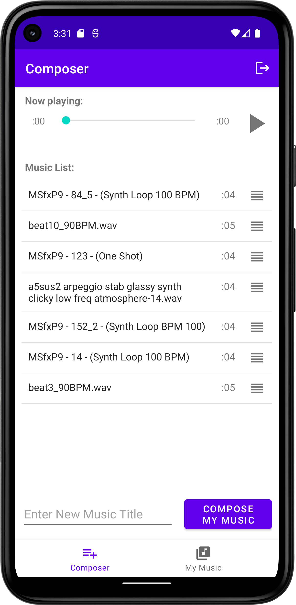
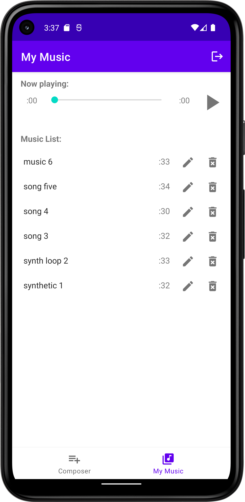
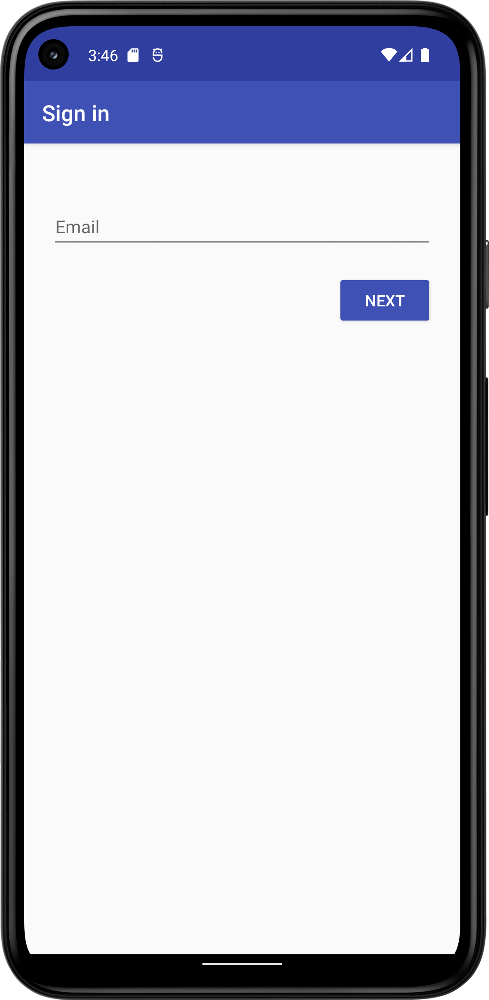

# Android-Composer

## App Overview
Android Composer is an app which finds multiple random short audio clips from the open internet and concatenates them to produce a new music piece. The app aims to provide creative ideas in music composition for professional composers.

## App User Interface
|Composer|My Music|User Login Interface|
|----|----|----|
||||

## Android Features
### Bottom Navigation 
- The app has a bottom navigation (two destinations: “Composer” and “My Music”)
- User can toggle between the two destinations at any time

### Action Bar 
- Title: displays the title of the fragment (“Composer” or “My Music”)
- Sign out : users can sign out at any time. This is a menu item in the action bar.

### MediaPlayer
- MediaPlayer is used for users to play either audio snippets or the music pieces that are user-created 
- Audio snippets are played as local files downloaded from Firebase Storage
- Music pieces are played using the URL from Firebase Storage without the document actually being downloaded to the local device

## API
### Freesound
Freesound aims to create a huge collaborative database of audio snippets, samples, recordings, bleeps, ... released under Creative Commons licenses that allow their reuse. Freesound provides new and interesting ways of accessing these samples.   
Freesound also aims to create an open database of sounds that can also be used for scientific research. Many audio research institutions have trouble finding correctly licensed audio to test their algorithms. 

### Firebase 
- Authentication
- Firestore Database 
- Storage
