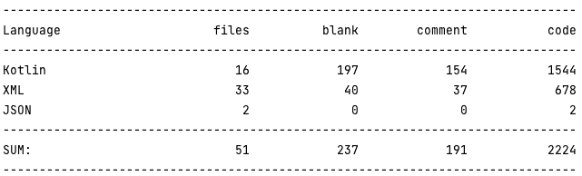

# ANDROID COMPOSER

## App Overview
Android Composer is an innovative app that generates unique music pieces by concatenating multiple random short audio clips from the internet. Designed for professional composers seeking creative inspiration, the app is built using Kotlin and leverages **LiveData** and **ViewModel** to manage data across multiple activities and fragments. The app's backend is powered by **Firebase**'s services such as **Authentication**, **Firestore Database**, and **Storage**.

## Video Demo
[Android Composer](https://youtu.be/BDDbA1enK_c)

## App User Interface
<!-- |Composer|My Music|User Login Interface|
|----|----|----|
|||| -->
<table>
<th>
Composer
</th>
<th>
My Music
</th>
<th>
User Login Interface
</th>
<tr>
<td>

</td>
<td>

</td>
<td>

</td>
</tr>
</table>

## API
### Freesound
The audio clips supplied in Android Composer app are downloaded through Freesound API. 
Freesound aims to create a huge collaborative database of audio snippets, samples, recordings, bleeps, ... released under Creative Commons licenses that allow their reuse. Freesound provides new and interesting ways of accessing these samples.   
Freesound also aims to create an open database of sounds that can also be used for scientific research. Many audio research institutions have trouble finding correctly licensed audio to test their algorithms. 

### Firebase 
- Authentication
>- Allow multiple users using the app at the same time
>- Limits each user with the ability to access the music pieces created by that specific user only.
- Firestore Database 
>- Stores metadata for each newly created music piece, each document represents a music piece created by users
>- "uuid" field is the unique reference connecting to the music file stored in Firebase Storage
- Storage
>- Stores the music files created by users
>- “uuid” field from Firestore Database references to the file name here
>- When uploading music files to Storage, additional metadata like “duration” and “musicTitle” are also attached

## Android Features
### MediaPlayer
- MediaPlayer is used for users to play either audio snippets or the music pieces that are user-created 
- Audio snippets are played as local files downloaded from Firebase Storage
- Music pieces are played using the URL from Firebase Storage without the document actually being downloaded to the local device
### Bottom Navigation 
- The app has a bottom navigation (two destinations: “Composer” and “My Music”)
- User can toggle between the two destinations at any time

### Action Bar 
- Title: displays the title of the fragment (“Composer” or “My Music”)
- Sign out : users can sign out at any time. This is a menu item in the action bar.

## Summary on lines of code
Summary from cloc:
